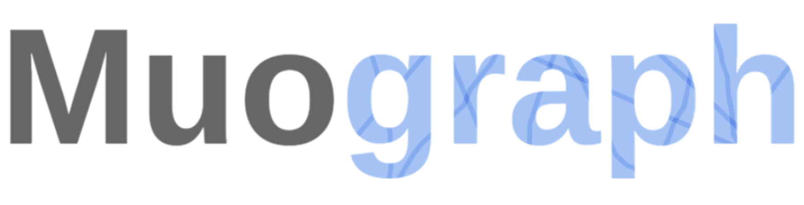
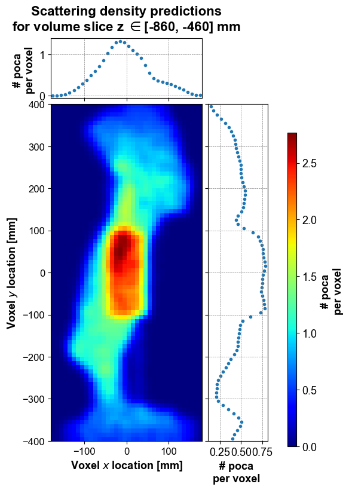

[](https://github.com/psf/black)


# MuographBeta: muon tomography library




This repo provides a library for muon scattering tomography and muon transmission tomography data analysis. 

## Overview

As a disclaimer, this library is more of an aggregate of muon tomography algorithms used throughtout PhD research rather than a polished product for the general public. As such, this repo targets mostly muon tomography reaserchers and enthousiasts.

Users can find ready to use scattering density algorihms as well as smaples of simulated data.

While curently being at a preliminary stage, this library is designed to be extended by users, whom are invited to implement their favorite reconstruction, material inference or image processing algorithms.



## Installation

The Python libraries required can be installed using [Conda](https://conda.io/projects/conda/en/latest/user-guide/getting-started.html), a powerful command line tool for package and environment managment.

It can be installed following these [instructions](https://conda.io/projects/conda/en/latest/user-guide/install/index.html), based on your operating system.

Simply run the following command:

```bash
cd MuographBeta/
conda env create --file=environment.yml
```

You can then activate/deactivate the environment with:

```bash
conda activate muograph
```

```bash
conda deactivate
```

## Examples

A few examples to introduce users to the package can be found in the `./example/` folder.


